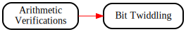

# Software Analysis Workbench Demos

These labs use Cryptol to demonstrate capabilities of the Software
Analysis Workbench, and as such are outside the scope of learning
Cryptol. Still, these may prove interesting or useful for students
with wider interests or different backgrounds, so they are included
here.

* [Arithmetic
  Verifications](./ArithmeticVerifications/ArithmeticVerifications.md):
  This lab demonstrates using SAW to prove facts about various
  arithmetic implementations. Some simple reference examples are
  included as well as an illustration of a barrier one may encounter
  when using these techniques.

* [Bit Twiddling](./Bittwiddling/Bittwiddling.md): This lab
   contains a collection of famous, yet hard to understand algorithms
   which perform relatively simple calculations. This is a simple
   introduction to how one can use Cryptol and SAW to prove that an
   implementation matches its specification.

## Suggested Flow for `SAW Demos`

Red lines in the image below show our recommended flow through
`SAW Demos`. Black lines indicate labs designed to give you more
opportunities to practice Cryptol, but are not strictly necessary
for completion. (Click on the image below for a navigable
representation.)

# Solicitation

How was your experience with this lab? Suggestions are welcome in the
form of a ticket on the course GitHub page:
https://github.com/weaversa/cryptol-course/issues

# From here, you can go somewhere!

||||
|-:|:-:|-|
|| [ - Language Basics ](../../Language/Basics.md) ||
|| **SAW Demos** ||
|| [ v Arithmetic Verifications ]( ./ArithmeticVerifications/ArithmeticVerifications.md ) ||

