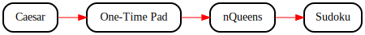

# Cryptol Demos

* [Caesar](./Caesar.md)
  Come, see, and conquer the classic.
* [One-Time Pad](./OneTimePad.md)
  Perfect secrecy, for once.
* [n-Queens](./NQueens.md)
  Cryptol is not just crypto.
* [Sudoku](./Sudoku.md)
  Diabolical made trivial.

## Suggested Flow for `Cryptol Demos`

Red lines in the image below show our recommended flow through
`Cryptol Demos`. Black lines indicate labs designed to give you more
opportunities to practice Cryptol, but are not strictly necessary
for completion. (Click on the image below for a navigable
representation.)

# Solicitation

How was your experience with this lab? Suggestions are welcome in the
form of a ticket on the course GitHub page:
https://github.com/weaversa/cryptol-course/issues

# From here, you can go somewhere!

||||
|-:|:-:|-|
|| [ - Language Basics ](../../Language/Basics.md) ||
|| **Cryptol Demos** ||
|| [ v Caesar ](Caesar.md) ||