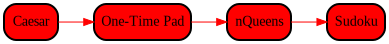

# Cryptol Demos

* [Caesar](./Caesar.md)
  Come, see, and conquer the classic.
* [One-Time Pad](./OneTimePad.md)
  Perfect secrecy, for once.
* [n-Queens](./NQueens.md)
  Cryptol is not just crypto.
* [Sudoku](./Sudoku.md)
  Diabolical made trivial.

# Solicitation

How was your experience with this lab? Suggestions are welcome in the
form of a ticket on the course GitHub page:
https://github.com/weaversa/cryptol-course/issues

# From here, you can go somewhere!

||||
|-:|:-:|-|
|| [- Language Basics](../../Language/Basics.md) ||
|| **Cryptol Demos** ||
|| [v Caesar](./Caesar.md) ||
