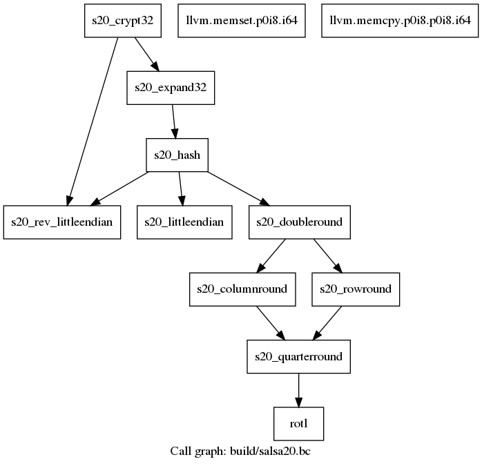
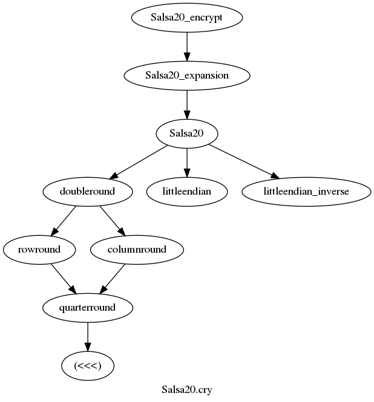
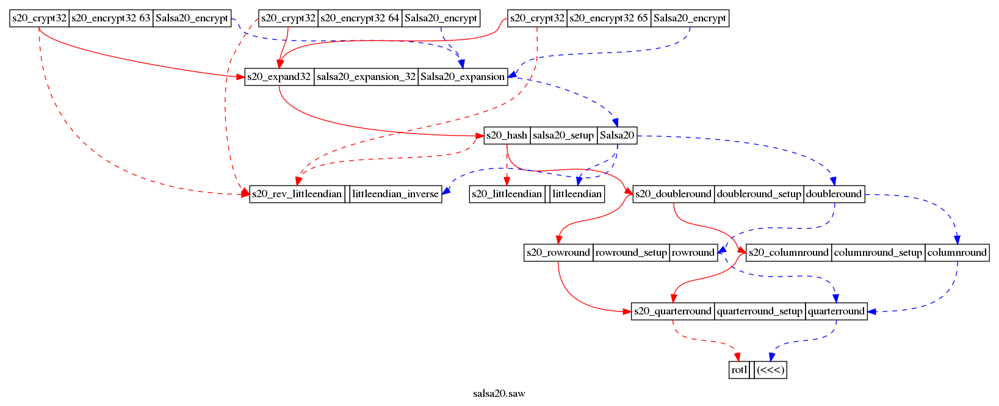

# Background

Before starting this module, we recommend perusing Galois's excellent
tutorial on
[_Program Verification with SAW_](https://saw.galois.com/intro/index.html).
That tutorial
  * introduces Cryptol and SAW
    (you can skip its setup instructions as their installation test
	should work in whichever environment you set up for this course)
  * specifies and verifies a simple bitcount implementation
  * introduces verification of pointer-based implementations
  * describes and motivates a _compositional_ verification of Salsa20
    (feel free to return to our module and revisit the next part later)
  * offers an extended exercise on proof maintenance for HMAC

# Uninterpreted Functions

_Program Verification with SAW_ demonstrates compositional verification
using _overrides_ that reflect an implementation's _callgraph_ to ease
the burden of proof for SAW:

> The third argument to `crucible_llvm_verify` is a list of
> `CrucibleMethodSpec` objects. While performing verification, the work
> that was done to construct a `CrucibleMethodSpec` is re-used.
> Specifically, instead of recursively symbolically executing a
> verified function, the prior specification is used as an
> axiomatization of its behavior.

The term _override_ comes from SAW's docstring for `llvm_verify`:

```SAW
sawscript> :h llvm_verify
Description
-----------

    llvm_verify : LLVMModule -> String -> [LLVMSpec] -> Bool -> LLVMSetup () -> ProofScript () -> TopLevel LLVMSpec

Verify the LLVM function named by the second parameter in the module
specified by the first. The third parameter lists the LLVMSpec
values returned by previous calls to use as overrides. The fourth (Bool)
parameter enables or disables path satisfiability checking. The fifth
describes how to set up the symbolic execution engine before verification.
And the last gives the script to use to prove the validity of the resulting
verification conditions.
```

One might wonder whether similar hints can ease the burden of proof by
axiomatizing a similarly complex Cryptol specification. Such hints are
called
[_uninterpreted functions_](https://www21.in.tum.de/teaching/sar/SS20/6.pdf),
which instruct an SMT solver or interface (
[SBV](http://leventerkok.github.io/sbv/) or
[What4](https://github.com/GaloisInc/what4)) to an underlying SMT
solver to treat a function (from the specification) as "uninterpreted".
The solver abstracts away these function definitions as arbitrary
functions satisfying the corresponding type signature. This removes any
other constraints on the function, so uninterpretation alone would
typically break a proof. But in conjunction with overrides (which
reintroduce the implementation's constraints on the specification),
this effectively axiomatizes a Cryptol symbol definition, avoiding
recursively expanding its underlying definitions. This is often
useful for implementations that are derived from or closely match a
Cryptol specification, as is the case for Galois's Salsa20 example
(but there are
[tradeoffs](https://es-static.fbk.eu/people/griggio/papers/lpar06_ack.pdf)
for this approach).

For instance, the following verification of `s20_doubleround` uses both
overrides and uninterpreted functions:

```SAW
dr <- llvm_verify m "s20_doubleround" [cr,rr] false doubleround_setup w4_unint_z3(['columnround', 'rowround']);
```

`cr` and `rr` refer to previous SAW verification results, whereas
`columnround` and `rowround` refer to definitions imported from
`Salsa20.cry`. Though this just shaves a few more tenths of a second
off verification of Salsa20 (and at worst *increases* proof times),
benefits become obvious for more complex verifications such as that of
AES and others in
[LibCrypto](https://github.com/awslabs/aws-lc-verification/blob/master/SAW/proof/AES/AES.saw),
a formally verified cryptographic library for Amazon Web
Services. (This script provides other advanced instructions to aid
SMT solvers that are beyond the scope of this course.)


## Practice with Uninterpreted Functions and Overrides

Now that we have added uninterpreted functions to our repertoire, let's
apply them to Salsa20...but first, let's more closely examine the
Galois tutorial's implementation and progress toward verifying it...

Clang/LLVM includes a command line tool called
[`opt`](https://llvm.org/docs/CommandGuide/opt.html). `opt` is
primarily an _optimizer_ (hence its name), but can also be used for
bitcode analysis. For now we are interested in its feature to generate
a _callgraph_:

```
> cd labs/Demos/Salsa20
> mkdir build
> clang -c -g -emit-llvm -Iinclude -o build/salsa20.bc src/salsa20.c
> opt -dot-callgraph -o dev/null build/salsa20.bc
cryptol-course/labs/Demos/SAW/Salsa20$ opt -dot-callgraph -o /dev/null build/salsa20.bc
Writing 'build/salsa20.bc.callgraph.dot'...
```

This produces a [dot](https://graphviz.org/doc/info/lang.html) graph,
which can be converted to an image viewable in a web browser:

```
> dot -Tpng -o build/salsa20.png build/salsa20.bc.callgraph.dot
```

<a href="../../../../misc/salsa20.bc.png">
    
</a>

(`llvm.*` are LLVM "intrinsics" that we can ignore for now.)

We are not aware of any similar tool to graphically depict Cryptol
modules, but here is a manually generated graph for `Salsa20.cry`:

<a href="../../../../misc/Salsa20.cry.png">
    
</a>

(These also call numerous functions from the Cryptol prelude, but we
can ignore most of these for now. `rotl` implements `(<<<)`, so we
include it in the graph.)

Finally, here is another manually generated graph that shows which SAW
method specifications are verified (or not) against which
implementation functions, using which Cryptol definitions, and which
potential overrides (based on the implementation's callgraph) and
function uninterpretations (based on dependencies among Cryptol
definitions) are used, in `salsa20.saw`:

<a href="../../../../salsa20.saw.png">
    
</a>

This assumes that each function in the implementation is specified by
one SAW method specification, which in turn refers to one Cryptol
specification that closely reflects the function being verified. This
is often not the case, but if so, shows a close correspondence between
specification and implementation, simplifying the assurance case.

Support for
[visualizing a SAW Remote API for Python script](https://github.com/GaloisInc/saw-script/issues/1664)
is in early development. This dashboard dynamically visualizes the
override graph of a SAW Remote API for Python proof script.

Informed by these visualizations, perhaps we can fill in some gaps...

**EXERCISE**: Add uninterpreted functions to `llvm_verify` instructions
(replace `abc` with `w4_unint_{solver}([{uninterpreted functions}])`) in
`salsa20.saw` that are straightforwardly implemented by functions in
`salsa20.bc`. (`s20_quarterround` implements `quarterround`, `s20_hash`
implements `Salsa20`, etc., as depicted by dashed blue edges in the
above graph.) How does this affect proof times? What happens if you
remove the overrides?

**EXERCISE**: Based on the above `salsa20.saw` diagram, are any
potential overrides missing from other `llvm_verify` instructions in
`salsa20.saw`? (Unused potential overrides are depicted as dashed red
edges in the above graph.) Are any implementation functions left
unspecified or unused in the compositional verification? (Dashed red
edges to nodes without an entry for a SAW method specification.) How
does specifying, verifying, and adding corresponding overrides and
uninterpreted functions affect proof times?
