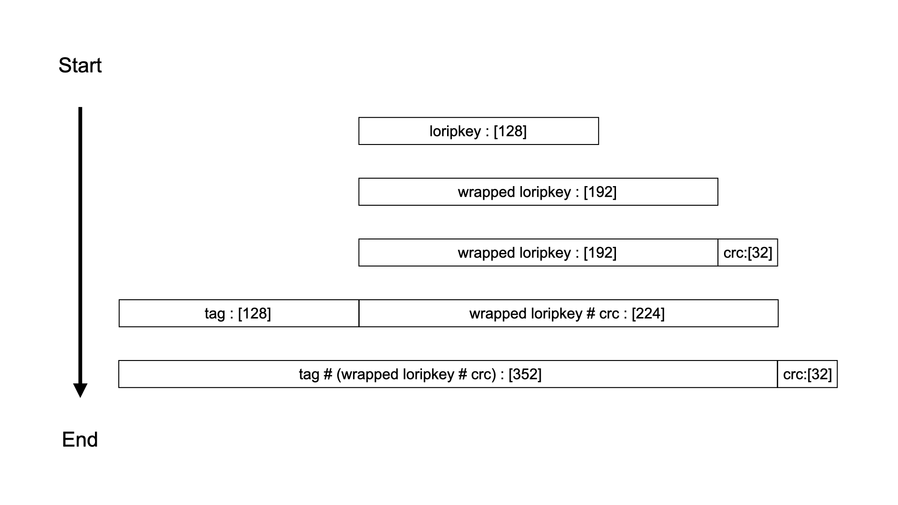

# Introduction

This lab is the capstone project for the course. It requires you to
use the results of previous labs to build and use keys to decrypt
secret messages.

## Prerequisites

Before working through this lab, you'll need 
  * Cryptol to be installed,
  * this module to load successfully, and
  * an editor for completing the exercises in this file.

You'll also need experience with
  * loading modules and evaluating functions in the interpreter,
  * Cryptol's sequence type,
  * manipulating sequences using `#`, `split`, and `join`, and
  * writing functions.

## Skills You'll Learn

Once you finish this lab you will have graduated from the Cryptol
course!

## Load This Module

This lab is a
[literate](https://en.wikipedia.org/wiki/Literate_programming) Cryptol
document --- that is, it can be loaded directly into the Cryptol
interpreter. Load this module from within the Cryptol interpreter
running in the `cryptol-course` directory with:

```Xcryptol session
Loading module Cryptol
Cryptol> :m labs::LoremIpsum::LoremIpsum
Loading module Cryptol
...
```

We start by defining a new module for this lab and importing some
accessory modules that we will use:

```cryptol
module labs::LoremIpsum::LoremIpsum where

import labs::LoremIpsum::KLI20

//This lab also requires three modules from previous labs.
//Once you figure out which are needed, fill them in below.

//import ???
//import ???
//import ???
```

You do not need to enter the above into the interpreter; the previous 
`:m ...` command loaded this literate Cryptol file automatically.
In general, you should run `Xcryptol session` commands in the 
interpreter and leave `cryptol` code alone to be parsed by `:m ...`.

# LoremIpsum Key

During this lab you will use the results of previous labs to
Cryptolize a **bogus** key generation specification we're calling the
LoremIpsum key. This document specifies the algorithm, but, like most
specification documents it also contains reams of text unrelated to
the algorithm. We've replaced these unhelpful portions with [lorem
ipsum](http://www.lipsum.com/), dummy text normally used for
typesetting that you should happily skip over to get to the important
bits.

**EXERCISE**: An important message has been encrypted using the
[KLI20](KLI20.cry) end cryptographic unit, a completely made up device
that was created specifically for use in this lab. The KLI20 takes
LoremIpsum keys (as specified below) as input and will then operate as
a stream cipher capable of encrypting or decrypting streams of
bytes. Please read through the specification document below and then
write Cryptol functions to generate the key specified here.

Also, we found some test vectors (in a separate document, of
course). Rather than recreate that document here, we've scraped them
out and placed them at the bottom of this document.

Let's begin.

# Lorem Ipsum Key Generation Specification

This document specifies how to generate key material for
interoperability with the [KLI20](KLI20.cry) end cryptographic
unit. The KLI20 uses a mix of [CRC](../CRC/CRC.md),
[KW-AE](../KeyWrapping/KeyWrapping.md), and
[Salsa20](../Salsa20/Salsa20.md) to encrypt and decrypt messages.

## Abstract

Lorem ipsum dolor sit amet, consectetur adipiscing elit. Suspendisse
convallis, nisl nec fermentum accumsan, lectus leo tristique eros, ut
tempor mi leo rutrum tortor. Vestibulum quis tellus leo. Vivamus
vehicula convallis bibendum.

Ultrices est, et vehicula arcu. Praesent in felis porta, lobortis
velit et, pretium nibh. In dui eros, vehicula id purus sit amet,
semper efficitur ex. Vestibulum pharetra fermentum est, ut auctor
tellus euismod eu. Aliquam bibendum massa purus, nec pretium orci
viverra ac. Curabitur aliquam scelerisque mauris vel rutrum. Proin
tincidunt viverra porta.

Donec eros mauris, tristique id volutpat ut, laoreet id odio. Vivamus
non rhoncus leo. Praesent sit amet fermentum diam. Duis porta, sem
lacinia lobortis ornare, tortor sem euismod nunc, non sodales elit
lectus elementum est. Quisque eu viverra urna. Sed vulputate
pellentesque nisl non feugiat. Nulla eu elementum quam. Nam rhoncus
dolor non odio dapibus interdum. Donec egestas aliquam justo id
volutpat. Fusce vel ante non ligula placerat tristique. Fusce laoreet
libero a mauris rutrum tempor. Duis quis convallis sapien.

Aenean rhoncus, orci eu varius iaculis, sapien magna pulvinar mauris,
ut scelerisque sapien ipsum aliquet orci. Nulla facilisi. Duis laoreet
ultrices est, et vehicula arcu. Praesent in felis porta, lobortis
velit et, pretium nibh. In dui eros, vehicula id purus sit amet,
semper efficitur ex. Vestibulum pharetra fermentum est, ut auctor
tellus euismod eu. Aliquam bibendum massa purus, nec pretium orci
viverra ac. Curabitur aliquam scelerisque mauris vel rutrum. Proin
tincidunt viverra porta.

# Introduction

Phasellus tortor erat, mollis non justo sit amet, iaculis commodo
felis. Integer neque sem, consequat sed risus ac, dignissim tincidunt
dolor. Pellentesque vestibulum nulla dui, vel faucibus lacus fermentum
feugiat. Morbi bibendum augue ornare nisi maximus, sed ultrices est
dignissim. Vivamus fringilla massa in efficitur rhoncus. Cras volutpat
sed massa sit amet pellentesque. Proin augue nunc, rhoncus vel lectus
at, consequat semper dolor. Vivamus sodales magna sed suscipit
pulvinar. Curabitur in massa neque. Proin tellus turpis, elementum
finibus accumsan at, congue a libero. Integer pharetra felis nec nulla
varius, vel maximus nisi congue. Ut vehicula sed turpis at
eleifend. Integer sed vehicula massa, vel scelerisque nisi.

Mauris at tortor bibendum est cursus molestie. Ut arcu eros, rhoncus
ac malesuada luctus, sagittis ut dolor. Interdum et malesuada fames ac
ante ipsum primis in faucibus. Curabitur at facilisis ligula. Mauris
efficitur, sapien non semper iaculis, lectus purus bibendum nibh, non
interdum velit est non enim. Cras egestas posuere lacinia. Nulla id
leo eleifend, tincidunt justo id, venenatis eros. Donec vitae mauris
et velit lobortis elementum.

Nullam aliquet sagittis purus, nec suscipit ipsum consequat
et. Pellentesque eget diam dictum lectus venenatis placerat. Ut et
dignissim sapien. Sed non molestie arcu, sit amet finibus
ligula. Curabitur imperdiet erat felis, eu tempor diam scelerisque sit
amet. Pellentesque sagittis malesuada mi eget venenatis. Proin
volutpat tellus eu sem lacinia, et tempor tortor tincidunt. Lorem
ipsum dolor sit amet, consectetur adipiscing elit. Aenean hendrerit
laoreet erat, eu accumsan diam luctus eget. Suspendisse vulputate
gravida felis vehicula malesuada. Nunc elementum massa sed sem
feugiat, id pulvinar nisi viverra. Sed ornare porta odio sit amet
pellentesque. Nullam eget leo ac leo posuere porta. Curabitur at
tellus lacinia, gravida lacus eu, imperdiet arcu. Suspendisse
bibendum, massa id rutrum scelerisque, nunc augue vestibulum lectus,
sed pulvinar tellus sem vitae lacus. Sed posuere non quam sit amet
tempor.


## Applicability

Morbi felis erat, elementum id gravida sed, ullamcorper ultrices
nibh. Lorem ipsum dolor sit amet, consectetur adipiscing elit. Mauris
luctus laoreet cursus. Cras nec felis auctor, venenatis lacus nec,
blandit lorem. Maecenas placerat ultrices nibh, eu ornare diam
ullamcorper quis. Maecenas vehicula neque at tellus fermentum
fermentum. Nullam efficitur, ligula vitae commodo mollis, nibh metus
iaculis ligula, non pulvinar massa nisl a velit. Nulla
facilisi. Curabitur quis neque leo. Morbi vitae rhoncus magna, sed
sodales nisi. Maecenas eleifend egestas tortor, id eleifend lorem
congue sit amet. Aenean pharetra risus id velit ultricies auctor. Orci
varius natoque penatibus et magnis dis parturient montes, nascetur
ridiculus mus.


## Definitions

Aliquam fermentum ultricies ligula. Duis dictum dictum mauris. Quisque
sit amet rutrum magna. Sed consequat nibh at ipsum semper
fermentum. Fusce a tellus rhoncus, placerat enim nec, lobortis
quam. Sed felis ligula, laoreet vitae tincidunt quis, imperdiet ut
arcu. Aliquam erat volutpat. Sed ligula elit, convallis vitae iaculis
vel, imperdiet sit amet tellus. Praesent vel lectus cursus, euismod
dolor ut, eleifend dolor. Duis sed nunc sed tellus consequat
tempus. Curabitur lacinia quam non massa dignissim auctor. Quisque ut
nisl fringilla, sagittis orci non, accumsan felis.

Vestibulum euismod, augue eu porta lobortis, ligula ipsum consectetur
diam, nec tristique urna velit sit amet nibh. Donec dignissim diam a
laoreet tempor. In sit amet eros eget quam interdum bibendum. Morbi
nec suscipit dolor. Nunc malesuada tempor pellentesque. Mauris vel
mattis massa. Phasellus et enim et dolor volutpat rhoncus in sit amet
tellus. In vehicula accumsan tempor. Nam iaculis orci vel urna
tincidunt, a sodales nisl bibendum.

Vestibulum cursus sodales porttitor. Etiam non tincidunt ex. Vivamus
vitae varius ligula. Duis condimentum neque lorem, at tincidunt odio
fringilla posuere. Ut at ligula nisl. Vestibulum a mauris
pellentesque, blandit sem aliquam, egestas metus. Nam at dictum magna,
laoreet venenatis massa.


## Overview

Praesent fringilla odio non purus posuere, et placerat dolor
faucibus. Nullam eget ultrices enim. Maecenas fringilla sed justo in
gravida. Nam cursus erat a odio porta pulvinar. Duis vitae augue vel
magna gravida consectetur id sit amet tortor. Nullam eu lacus a ex
pharetra lobortis ornare maximus turpis. Duis auctor velit eget diam
pellentesque dictum.

Donec eros mauris, tristique id volutpat ut, laoreet id odio. Vivamus
non rhoncus leo. Praesent sit amet fermentum diam. Duis porta, sem
lacinia lobortis ornare, tortor sem euismod nunc, non sodales elit
lectus elementum est. Quisque eu viverra urna. Sed vulputate
pellentesque nisl non feugiat. Nulla eu elementum quam. Nam rhoncus
dolor non odio dapibus interdum. Donec egestas aliquam justo id
volutpat. Fusce vel ante non ligula placerat tristique. Fusce laoreet
libero a mauris rutrum tempor. Duis quis convallis sapien.

<kbd></kbd>
**Figure 1. Lorem Ipsum Key Generation Flow Diagram**

Aenean rhoncus, orci eu varius iaculis, sapien magna pulvinar mauris,
ut scelerisque sapien ipsum aliquet orci. Nulla facilisi. Duis laoreet
ultrices est, et vehicula arcu. Praesent in felis porta, lobortis
velit et, pretium nibh. In dui eros, vehicula id purus sit amet,
semper efficitur ex. Vestibulum pharetra fermentum est, ut auctor
tellus euismod eu. Aliquam bibendum massa purus, nec pretium orci
viverra ac. Curabitur aliquam scelerisque mauris vel rutrum. Proin
tincidunt viverra porta.

Donec eros arcu, maximus nec consectetur in, laoreet in nibh. Maecenas
dictum turpis sit amet cursus vulputate. Cras blandit dui et libero
placerat laoreet. In pretium fringilla tincidunt. Fusce orci lacus,
gravida eleifend iaculis a, dignissim sit amet sem. Phasellus eget
aliquet ex, non aliquam lacus. Praesent sit amet tellus vitae leo
semper tempus at ut massa. Proin cursus dui at ligula ultrices,
aliquam cursus arcu scelerisque. Cras id mauris ac lectus lacinia
aliquet. Ut eu auctor magna. Maecenas ultricies, justo nec posuere
aliquet, sapien nunc convallis purus, sed mollis odio risus nec
orci. Sed porttitor felis vitae magna elementum tristique in vel
est. Etiam ut nisi sed felis lacinia posuere. Etiam dignissim, dolor
ut blandit fermentum, mi dui tincidunt ante, id tempus leo ex auctor
mi. Sed porttitor pulvinar efficitur. Duis id dui tincidunt ligula
facilisis tristique.


# Specification of the Cyclic Redundancy Check

Cyclic Redundancy Checks (CRC) are used to add integrity to the Lorem
Ipsum key at two stages of generation, namely, after key wrapping and
after tagging.


## CRC-32

The specific variant of CRC used is the CRC-32c defined in
[RFC 3309](https://tools.ietf.org/pdf/rfc3309.pdf). For reference, the
polynomial is given as:

x^32 + x^28 + x^27 + x^26 + x^25 + x^23 + x^22 + x^20 + x^19 + x^18 +
x^14 + x^13 + x^11 + x^10 + x^9 + x^8 + x^6 + 1


# Computational Requirements

Aenean eget tristique ante. Ut feugiat, purus quis pellentesque
facilisis, arcu lectus tincidunt nisl, vel scelerisque ligula urna non
nulla. Morbi ac fermentum nibh. Curabitur at ligula elit. Quisque
lorem sapien, pretium eu mattis at, tempor ut ipsum. Aenean tempor
finibus sapien, a fermentum velit pulvinar sit amet. Nunc accumsan
hendrerit sapien et tristique. Vivamus vitae euismod
nulla. Suspendisse volutpat leo ac rhoncus luctus.


## Extra Considerations

Nam auctor tortor est, vitae vulputate quam laoreet
volutpat. Phasellus tincidunt in ipsum et porta. Maecenas ultricies
tellus et imperdiet vulputate. Sed efficitur lectus a laoreet
lacinia. Praesent quis lorem non risus varius commodo. Maecenas
ullamcorper vel est et fringilla. Etiam nec ornare nibh. Morbi lacus
lectus, molestie et pretium quis, scelerisque nec nisi.

Nulla arcu nisl, vehicula in elementum a, molestie id tortor. Ut leo
risus, eleifend nec congue quis, porta vel enim. Donec feugiat metus
sit amet aliquam rhoncus. Duis mi lectus, vehicula vitae efficitur
quis, aliquet ut justo. Praesent facilisis enim quis augue maximus,
quis mollis turpis suscipit. Sed at magna ut ante congue posuere vitae
eget nunc. Vivamus vestibulum, quam quis volutpat vehicula, quam nisi
pulvinar mauris, et pretium sem tortor ut tortor. In lacinia feugiat
ullamcorper.


# Key Wrap Specification

The Lorem Ipsum key is wrapped using the KW-AE 128 Algorithm described
in [NIST Special Publication
800-38F](https://csrc.nist.gov/publications/detail/sp/800-38f/final)
"Recommendation for Block Cipher Modes of Operation: Methods for Key
Wrapping". This algorithm takes a 128-bit KEK and 128-bit key and
produces 192 bits of wrapped key.


## Example:

KEK = [0x0001020304050607, 0x08090A0B0C0D0E0F]

k = [0x0011223344556677, 0x8899AABBCCDDEEFF]

KW-AE 128 (KEK, k) = [0x1fa68b0a8112b447, 0xaef34bd8fb5a7b82, 0x9d3e862371d2cfe5]


# Providing Notice of Expected Changes

Suspendisse nulla magna, dignissim quis urna a, tempus convallis
libero. Vivamus tristique fermentum quam, ut egestas neque. Mauris
efficitur faucibus dolor, eget ultrices ipsum congue at. Ut varius
ligula porttitor ipsum pharetra, eu sollicitudin ipsum pulvinar. Fusce
laoreet non nulla ut blandit. Cras vel imperdiet nibh, at pulvinar
metus. Mauris blandit bibendum mattis. Phasellus in dui quis lorem
molestie consequat. Fusce sed purus imperdiet, commodo orci vitae,
rutrum dui. Duis fermentum, nisi in gravida fringilla, dolor nulla
fringilla est, sed aliquam purus odio vel enim. Donec faucibus nulla
sit amet ex interdum egestas in in ligula. Praesent vitae sem eu ex
tincidunt accumsan. Nam vitae ipsum tellus. Donec varius malesuada
nisi, quis blandit augue luctus ut.

Sed dictum lectus quis eros tempor lacinia. Class aptent taciti
sociosqu ad litora torquent per conubia nostra, per inceptos
himenaeos. Sed venenatis ante neque, lobortis cursus erat bibendum
et. Maecenas pharetra ullamcorper ipsum, vel faucibus velit tincidunt
id. Class aptent taciti sociosqu ad litora torquent per conubia
nostra, per inceptos himenaeos. Mauris ex augue, lacinia sed metus
vel, imperdiet viverra dolor. Etiam id pretium lectus, ac convallis
ante. Sed porta, turpis a commodo eleifend, metus elit vehicula nulla,
quis malesuada leo ipsum non mi. Proin consectetur lacinia rhoncus. In
eleifend fermentum mi at volutpat. Aliquam erat volutpat. Quisque a
elit non augue malesuada volutpat a ultrices ligula.

Sed ligula urna, gravida ac arcu eu, placerat dictum sem. Curabitur
bibendum leo in orci ultrices, eget finibus purus dignissim. Praesent
at magna non neque cursus sagittis non vel purus. Donec sit amet augue
venenatis, auctor ante ullamcorper, tincidunt sapien. Proin ac
convallis purus. Sed facilisis tellus in justo suscipit, at volutpat
lectus lacinia. Vestibulum viverra, lorem ac tempor efficitur, dui
turpis ultricies ligula, sed ultricies urna mi nec metus.


# Algorithm Transition Mechanisms

Curabitur vulputate accumsan augue, eget vulputate massa ornare
eu. Fusce et diam in eros facilisis vehicula sit amet a quam. Nullam
fermentum mauris eu augue rhoncus, interdum pulvinar ligula
finibus. Pellentesque nisl sapien, molestie at tempor molestie,
scelerisque id neque. Donec rhoncus id odio et pharetra. Mauris vel
risus a leo tristique consequat. Vivamus vel ex in ex posuere
tincidunt sit amet ac orci.

Praesent tristique neque dui, quis vulputate nisl dictum at. Fusce sed
egestas ante, et fringilla ligula. Vivamus laoreet porttitor
imperdiet. Cras rutrum mauris in leo condimentum consequat. Quisque
interdum posuere enim, eu laoreet nisi pulvinar in. Integer bibendum
diam nec cursus malesuada. Duis vulputate consequat est, et
condimentum nunc scelerisque ut.


# Wrapped Key Tagging

Etiam malesuada eu enim in semper. Pellentesque eget vehicula
ligula. In aliquet massa posuere pellentesque porttitor. Mauris
consequat enim nec velit cursus, eu scelerisque purus
tincidunt. Quisque pulvinar enim urna, non ullamcorper est blandit
et. Nam massa ante, molestie ac malesuada et, eleifend vitae lacus. Ut
tempus neque mi, id ullamcorper ex eleifend sit amet.


## Specification

The 13-character constant ASCII string "LoremIpsumKey" followed by a
given 3-ASCII-digit key issue number will be prepended to the 192-bit
wrapped key after the first CRC-32c has been applied.


### Valid Issue Numbers

The KLI20 will accept any 24-bit issue number. However, this key
specification only uses issue numbers that correspond to the ASCII
strings between and including "000" to "999". Specifically, this key
specification follows a special schedule that is composed entirely of
the three issue numbers corresponding to the Pythagorean triplet for
which a + b + c = 1000 (more info available
[here](../projecteuler/projecteuler.md)). These numbers are scheduled
to be issued in increasing order.


### Security Considerations

In lacinia vel erat quis rutrum. Aliquam erat volutpat. Aliquam erat
volutpat. Vestibulum dictum non elit at bibendum. Vivamus non mi
pulvinar, tempor ligula in, bibendum erat. Mauris sit amet est
posuere, eleifend eros eu, pulvinar neque. In suscipit ipsum eu
pellentesque finibus. Suspendisse placerat est non odio fermentum, at
suscipit dolor placerat. Curabitur rutrum, odio lacinia fringilla
cursus, lorem turpis rhoncus leo, eget facilisis velit tortor a justo.

Mauris sed massa pharetra, viverra mi blandit, posuere
turpis. Suspendisse laoreet sem consectetur sapien ultrices, vitae
tempus lacus consectetur. Nulla imperdiet elit nec metus consectetur
feugiat. Ut cursus eget dolor at cursus. Vestibulum ante ipsum primis
in faucibus orci luctus et ultrices posuere cubilia curae; Morbi non
facilisis nibh. Aenean efficitur purus a lectus dapibus
venenatis. Vestibulum commodo molestie velit nec tincidunt. Donec
pharetra pretium risus eget consectetur. Suspendisse ac ornare neque,
eu vehicula ex. Sed at dignissim ante. Praesent tincidunt lobortis
eros. Pellentesque ultrices luctus nisl, non mattis eros commodo
ut. Sed dictum malesuada libero, id mattis metus dictum in.

Donec vitae eros a arcu mattis mattis. Quisque nibh augue, auctor in
mi eget, ornare efficitur felis. Aliquam efficitur nisl quis sagittis
finibus. Aliquam in turpis sed risus lobortis aliquet eu non
risus. Class aptent taciti sociosqu ad litora torquent per conubia
nostra, per inceptos himenaeos. Vivamus ultricies sem vel justo
fringilla luctus. Ut pulvinar luctus dui, sed cursus arcu maximus
eu. Vivamus ac iaculis mauris. Aliquam consequat dolor sit amet nibh
molestie convallis. Aliquam ut nunc porttitor, imperdiet ligula eu,
consectetur diam. Phasellus euismod velit elementum fermentum
semper. Suspendisse porta vestibulum diam non fringilla.


# Test Vectors

Some test vectors are provided here to help you test your Lorem Ipsum
key generation specification. First, wrap the `secretKey` with the
`KEK`, both found below, using all approved issue numbers to create a
suite of LoremIpsum keys.

```cryptol
TestKEK = 0x3d43108b5b243b90dda78f75736cc629

secretKey = 0x569b79f606aba26f4263b7147ba3c5e0
```

Then, feed the keys you create into the [KLI20](KLI20.cry) device
(provided in this same repository) to decrypt the following secret
messages:

```cryptol
secretMessageIssue0 = 0x0d84af8336884da53714f6eafa2bf80f38e5028d208ce39c8d78a1f768738413aa577598816241adf3077e2587ffbd7456e8583a2155e6411dc64a15e414bafc2556184488a353c54d5f274c2b54eef4ef7ebd8d9a7f13137e6bacf1b7ff605dd55443d7a980e7ba298919fd432be0082699ece1d8c1f8e0849bcc1beb07a2c005c622ae1e5fe79e43ae31f0a1c13b9baa045ceeb9a43ee47a7d09702187c8f8ab51309c308f1b7d22ac2bc2da49487c88ebd527127a709da2418c35

secretMessageIssue1 = 0x7f0f165e95c728ab1d1c07aa3c12cc10d5a975394c37eb5870be8b5495334ff472c5192b9f97faea063540b5f11d51fdbbdb4117ea9612cc0c6b42c3b70dab7615cd

secretMessageIssue2 = 0x4ba6d9eb8489faed2223bd5e3bbf5bf313708c38b369b0fea673c76843cf5312252984b024c2f4263ef318dfbade320920558cb7e475c54811f955a612ab9e18128e1adb056e5775
```
