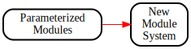

# Module System

* [Parameterized Modules](./SimonSpeck/SimonSpeck.md)
  Cut your teeth on Cryptol modules with the Simon/Speck family of
  related block ciphers.
* [New Module System](./NewModuleSystem/NewModuleSystem.md)
  Unleash the full power of Cryptol 3's new module system on
  modes of operation for any compatible block cipher.

# Solicitation

How was your experience with this lab? Suggestions are welcome in the
form of a ticket on the course GitHub page:
https://github.com/weaversa/cryptol-course/issues

# From here, you can go somewhere!

||||
|-:|:-:|-|
|| [< Cryptographic Properties](../CryptoProofs/CryptoProofs.md) ||
|| **Module System** ||
|| [v Parameterized Modules](./SimonSpeck/SimonSpeck.md) ||
