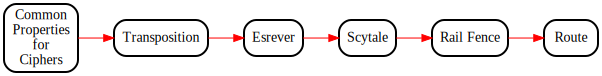

Here, there are a series of labs on transposition ciphers. They are
meant to be visited in the following order:
* [CommonProperties](./CommonProperties.md): an offshoot of `CryptoProofs` treating higher-order functions and properties.
* [Transposition](./Transposition.md): a library defining common concepts for transposition ciphers; most notably permutation mappings and supporting functions and properties.
* [Esrever](./Esrever.md): a trivial reverse "cipher" demonstrating how to specify permutation mappings for the encrypt and decrypt functions from Transposition:
* [Scytale](./Scytale.md): an adaptation of the Scytale cipher described in Programming Cryptol.
* [RailFence](./RailFence.md): a specification of the Rail Fence cipher, which is easy on paper but hard in Cryptol.
* [Route](./Route.md): an unguided suggestion for sufficiently motivated course participants to define the Route cipher using concepts learned in prior labs.

## Suggested Flow for `Transposition Ciphers`

Red lines in the image below show our recommended flow through
`Transposition Ciphers`. Black lines indicate labs designed to give you more
opportunities to practice Cryptol, but are not strictly necessary
for completion. (Click on the image below for a navigable
representation.)

# Solicitation

How was your experience with this lab? Suggestions are welcome in the
form of a ticket on the course GitHub page:
https://github.com/weaversa/cryptol-course/issues

# From here, you can go somewhere!

||||
|-:|:-:|-|
|| [ - Cryptographic Properties ](../CryptoProofs/CryptoProofs.md) ||
|| **Transposition Ciphers** ||
|| [ v Common Properties for Ciphers ](CommonProperties.md) ||